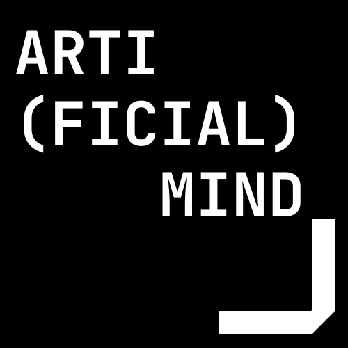

# Artificial Mind

## Логотип
Была выбрана крайне простая цветовая палитра, которая не раздражает глаз. Данный шрифт был выбран по той причине, что он лучше всего ассоциируется с программированием и цифровыми технологиями. Простота логотипа связана с основной идеей нашей студии: "Простые решения сложных задач".

## Название студии
Artificial mind переводится как "Искусcтвенный разум", что сразу ассоциируется с цифровыми технологиями. Название необычное для рынка, что делает его легко запоминаемым. 

### Ниже представлены два примера логотипа для нашей студии.

